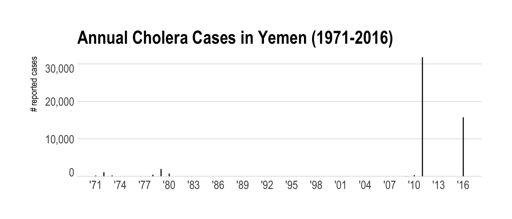

# Reading and Querying CSV Data With Drill and R

## Problem

You have a CSV file and want to use Drill and R to query it vs read it in to R directly with one of the many "read CSV" functions.

## Solution

Store the CSV file in a directory Drill can access and query it with R.

## Discussion

The Drill manual chapter on _"Text Files: CSV, TSV, PSV"_^[[Text Files: CSV, TSV, PSV](https://drill.apache.org/docs/text-files-csv-tsv-psv/)] discusses--at length--how Drill works with this delimited storage format. Future recipes will show how to convert CSV files to a better format (parquet) and, for now, if your CSV file contains a header (as most "normal" CSV files do) there will be one additional step involved before querying it.

For this example, we'll use World Health Organization (WHO) data on cholera^[[WHO Cholera Reported Cases](http://apps.who.int/gho/data/node.main.175?lang=en)]. A verison of that file is in <https://raw.githubusercontent.com/hrbrmstr/drill-sergeant-rstats/master/book-data/who-colera.csv>.

You'll need to store this file <https://raw.githubusercontent.com/hrbrmstr/drill-sergeant-rstats/master/book-data/who-cholera.csv> in an accessible place by Drill. The default `dfs.root` storage location is the "top" of your local filesystem hierarchy. It is suggested (for this example) that you put the `who-colera.csv` into a `Data` directory underneath your home directory (shorthand filesystem reference for that directory being `~/Data`). The full `dfs.root` for the system used in this example is:

    dfs.root.`/Users/bob/Data/who-cholera.csv`

Replace `bob` with your home directory name. (`TBD`: Windows example path)

However, because this data file has a header, you should (for this example) rename it to use the `.csvh` extension vs the `.csv` extension. So, the `dfs` path should actually be:

    dfs.root.`/Users/bob/Data/who-cholera.csvh`

The `h` at the end let's Drill's CSV parser know that there are column headers. A future recipe will show you how to make that the default. Note that there are many contexts where CSV files are generated at a regular frequency as part of a well-established process and do not have or require a header line. No header CSVs were used well-before the "big data" term popped up but were heavily used in the early days of "modern" big data processing since header lines in well-established workflows can slow down processing.

>You've likely noticed this is a small CSV file. Drill can handle large CSV files well, too, as you'll see in the next recipe.

Now we can work with this data via `sergeant`. We'll first take a look at it:


```r
library(sergeant)
library(tidyverse)

db <- src_drill("localhost")

who_cholera <- tbl(db, "dfs.root.`/Users/bob/Data/who-cholera.csvh`")

who_cholera
```

```
## # Source:   table<dfs.root.`/Users/bob/Data/who-cholera.csvh`> [?? x 3]
## # Database: DrillConnection
##    country     year  reported_cases
##    <chr>       <chr>          <int>
##  1 Afghanistan 2016             677
##  2 Afghanistan 2015           58064
##  3 Afghanistan 2014           45481
##  4 Afghanistan 2013            3957
##  5 Afghanistan 2012              12
##  6 Afghanistan 2011            3733
##  7 Afghanistan 2010            2369
##  8 Afghanistan 2009             662
##  9 Afghanistan 2008            4384
## 10 Afghanistan 2005              33
## # ... with more rows
```

One difference between "normal" `dplyr` and "database" `dplyr` is that data operations stay at the database until you retrieve them. This is done with `collect()`. All of the cholera data is still in Drill and the printed display shows 10 observations because the actual query sent to Drill to give you that view is:

    SELECT * FROM  dfs.root.`/Users/bob/Data/who-cholera.csvh`  LIMIT 10

This particular CSV file is small enough to `collect()` and work with locally so you could do:


```r
cholera_df <- collect(who_cholera)

cholera_df
```

```
## # A tibble: 2,470 x 3
##    country     year  reported_cases
##  * <chr>       <chr>          <int>
##  1 Afghanistan 2016             677
##  2 Afghanistan 2015           58064
##  3 Afghanistan 2014           45481
##  4 Afghanistan 2013            3957
##  5 Afghanistan 2012              12
##  6 Afghanistan 2011            3733
##  7 Afghanistan 2010            2369
##  8 Afghanistan 2009             662
##  9 Afghanistan 2008            4384
## 10 Afghanistan 2005              33
## # ... with 2,460 more rows
```

and have it all in R. Drill also perform aggregation and other operations for you.

You may have noticed that all three columns are `<chr>` that is due to Drill being _schema-less_ and not really knowing how the CSV file is structured, so it returns the data to R with no hints as to the column data types.

Since we're working with a datbase, we can "fix" this by being more verbose in how we ask for this CSV data. The second parameter to `tbl()` does not just have to be a "table" reference. It can be a full SQL query that returns "rectangular" results that can be turned into an R data frame. Drill's syntax requires such a query to be wrapped in parentheses. We can make the above data a bit more useful with:


```r
tbl(db, "(
SELECT
  country,
  CAST(LTRIM(`year`, ' ') AS int) AS `year`,
  CAST(reported_cases AS int) AS reported_cases
FROM dfs.root.`/Users/bob/Data/who-cholera.csvh`
)") -> who_cholera

who_cholera
```

```
## # Source:   table<( SELECT country, CAST(LTRIM(`year`, ' ') AS int) AS
## #   `year`, CAST(reported_cases AS int) AS reported_cases FROM
## #   dfs.root.`/Users/bob/Data/who-cholera.csvh` )> [?? x 3]
## # Database: DrillConnection
##    country      year reported_cases
##    <chr>       <int>          <int>
##  1 Afghanistan  2016            677
##  2 Afghanistan  2015          58064
##  3 Afghanistan  2014          45481
##  4 Afghanistan  2013           3957
##  5 Afghanistan  2012             12
##  6 Afghanistan  2011           3733
##  7 Afghanistan  2010           2369
##  8 Afghanistan  2009            662
##  9 Afghanistan  2008           4384
## 10 Afghanistan  2005             33
## # ... with more rows
```

The `CAST()`  function performs data type conversion and `LTRIM()` is used to "left trim" characters from strings. The `CAST` gives a hint about the data type and R now knows it's an `integer`. But, why did we need to use `LTRIM`? You likely didn't notice the extra `' '` at the beginning of the entriesin the year column:

    "country","year","reported_cases"
    "Afghanistan"," 2016","677"
    "Afghanistan"," 2015","58064"
    "Afghanistan"," 2014","45481"
    "Afghanistan"," 2013","3957"
    "Afghanistan"," 2012","12"

Removing that is necessary before the conversion to integer.

As noted earlier, we can perform wrangling operations in-database vs in-R:


```r
count(who_cholera, country, wt=reported_cases, sort=TRUE)
```

```
## # Source:     lazy query [?? x 2]
## # Database:   DrillConnection
## # Ordered by: desc(n)
##    country                                n
##    <chr>                              <int>
##  1 India                            1363250
##  2 Haiti                             795794
##  3 Peru                              736195
##  4 Democratic Republic of the Congo  521607
##  5 Indonesia                         394945
##  6 Mozambique                        327913
##  7 Somalia                           311203
##  8 Nigeria                           310217
##  9 Bangladesh                        294647
## 10 Afghanistan                       263843
## # ... with more rows
```

```r
group_by(who_cholera, country) %>% 
  summarise(avg_annual_cases = mean(reported_cases))
```

```
## # Source:   lazy query [?? x 2]
## # Database: DrillConnection
##    country     avg_annual_cases
##    <chr>                  <dbl>
##  1 Afghanistan         11993   
##  2 Albania               626   
##  3 Algeria               636   
##  4 Angola               7348   
##  5 Argentina             758   
##  6 Armenia                25.0 
##  7 Australia               3.74
##  8 Austria                 1.00
##  9 Azerbaijan             18.0 
## 10 Bahamas                 1.00
## # ... with more rows
```


```r
library(hrbrthemes)

filter(who_cholera, country == "Yemen") %>% 
  collect() %>% 
  mutate(year = as.Date(sprintf("%s-01-01", year))) %>% 
  ggplot(aes(year, reported_cases)) +
  geom_segment(aes(xend=year, yend=0)) +
  scale_x_date(date_breaks="3 years", date_labels="'%y") +
  scale_y_comma() +
  labs(
    x = NULL, y = "# reported cases",
    title = "Annual Cholera Cases in Yemen (1971-2016)"
  ) +
  theme_ipsum(grid="Y") +
  theme(axis.text.y=element_text(vjust=c(0, rep(0.5, 2), 1)))
```



Future recipes will help you debug issues when `CAST`ing data from "malformed" CSV files.

## See Also

- [Drilling CSV files - A simple example](https://mapr.com/developercentral/code/drilling-csv-files-simple-example/)
- [Apache Drill case study: A tutorial on processing CSV files](http://www.theserverside.com/tutorial/Apache-Drill-case-study-A-tutorial-on-processing-CSV-files)
