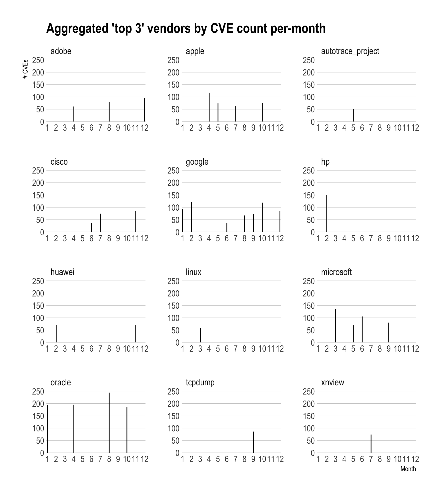

# Reading a "Traditional" JSON Data File With Drill & R 

## Problem

You have a "traditional" (i.e. not [ndjson](http://ndjson.org/)) JSON data file and want to read and query it with Drill and R.

## Solution

Put the file into an accessible directory by Drill and query it with R, perhaps some SQL, and `sergeant`.

## Discussion

There are two main "flavours" of JSON data files. The first is "traditional" JSON where a file contains a JSON object. Said object can be very complex and have a great deal of nested bits in it, but it is still a file with one JSON object. Newline-delimited JSON (a.k.s. "JSON Lines" or "ndjson") compacts a JSON object onto one line and stores one object after another on separate lines, delmited by a newline character. 

"Traditional" JSON is generally something you'd get from an API call, but there are plenty of JSON data files in this format that you may come across or even have on hand. Streaming JSON ("ndjson", from now on) will be covered in a future recipe.

A good example of a "traditional" JSON file lies in the National Vulnerability Database (NVD) Feeds^[[NVD Feeds](https://nvd.nist.gov/vuln/data-feeds#JSON_FEED)]. Pull the one for 2017, <https://static.nvd.nist.gov/feeds/json/cve/1.0/nvdcve-1.0-2017.json.gz>, and remember to store it in your `~/Data` directory.

This is what the first portion of the file looks like:

    {
      "CVE_data_type": "CVE",
      "CVE_data_format": "MITRE",
      "CVE_data_version": "4.0",
      "CVE_data_numberOfCVEs": "13636",
      "CVE_data_timestamp": "2018-03-25T07:01Z",
      "CVE_Items": [
        {
          "cve": {
            "data_type": "CVE",
            "data_format": "MITRE",
            "data_version": "4.0",
            "CVE_data_meta": {
              "ID": "CVE-2017-0001",
              "ASSIGNER": "cve@mitre.org"
            },
            "affects": {
              "vendor": {
                "vendor_data": [
                  {
                    "vendor_name": "microsoft",
                    "product": {
                      "product_data": [
                        {
                          "product_name": "windows_10",
                          "version": {
                            "version_data": [
                              {
                                "version_value": "-"
                              },
                              {
                                "version_value": "1511"
                              },
                              {

There are some informational fields at the beginning, but all the data is in a big JSON array under `CVE_Items`. You can take a look at the NVE CVE JSON Schema^[[NVD CVE JSON Schema](https://csrc.nist.gov/schema/nvd/feed/0.1/nvd_cve_feed_json_0.1_beta.schema)] and the CVE JSON Schema^[[CVE JSON Schema](https://csrc.nist.gov/schema/nvd/feed/0.1/CVE_JSON_4.0_min.schema)] to get a feel for the organizational structure of each record.

When approaching a new, complex file like this, the Drill Query interface (<http://localhost:8047/query>) is a handy way to look at it. We can separate out the array of `CVE_Items` into rows and take a look:

    SELECT FLATTEN(a.CVE_Items) 
    FROM dfs.root.`/Users/bob/Data/nvdcve-1.0-2017.json.gz` a 
    LIMIT 10


>The `a` is in that query since We need to assign the table an alias to be able to dig into JSON records in a given column. You can use the more verbose `AS a` if you like as well since that can make queries a bit more readable to folks new to SQL.

Run that query yourself and scroll across and down to see the complexity of each record (the schema may also help you identify potentially good target fields).

We can dig deep within the nested JSON to extract a more "rectangular" structure.  Let's say we wanted to pull the:

- CVE identifier
- first impacted vendor
- first impacted product of the vendor
- first description of the vulnerability
- date the vulnerability was published

One possible query for this (SQL is somewhat flexible, like R) is the following:

    SELECT 
      b.item.cve.CVE_data_meta.ID AS cve_id,
      b.item.cve.affects.vendor.vendor_data[0].vendor_name AS vendor_name,
      b.item.cve.affects.vendor.vendor_data[0].product.product_data[0].product_name AS product_name,
      b.item.cve.description.description_data[0]['value'] AS description,
      SUBSTR(b.item.publishedDate, 1, 10) as pub_date
    FROM  
      (SELECT FLATTEN(a.CVE_Items) AS item 
       FROM dfs.root.`/Users/bob/Data/nvdcve-1.0-2017.json.gz` AS a) AS b 
       LIMIT 10

Try that in the Drill query interface and you should see:

<!-- -->

Let's hook that query up with `sergeant` (minus the `LIMIT 10`):


```r
library(sergeant)
library(tidyverse)

db <- src_drill("localhost")

tbl(db, "(
SELECT 
  b.item.cve.CVE_data_meta.ID AS cve_id,
  b.item.cve.affects.vendor.vendor_data[0].vendor_name AS vendor_name,
  b.item.cve.affects.vendor.vendor_data[0].product.product_data[0].product_name AS product_name,
  b.item.cve.description.description_data[0]['value'] AS description,
  SUBSTR(b.item.publishedDate, 1, 10) as pub_date
FROM  
  (SELECT FLATTEN(a.CVE_Items) AS item 
   FROM dfs.root.`/Users/bob/Data/nvdcve-1.0-2017.json.gz` AS a) AS b
)") -> cve_smaller

cve_smaller
```

```
## # Source:   table<( SELECT b.item.cve.CVE_data_meta.ID AS cve_id,
## #   b.item.cve.affects.vendor.vendor_data[0].vendor_name AS vendor_name,
## #   b.item.cve.affects.vendor.vendor_data[0].product.product_data[0].product_name
## #   AS product_name, b.item.cve.description.description_data[0]['value']
## #   AS description, SUBSTR(b.item.publishedDate, 1, 10) as pub_date FROM
## #   (SELECT FLATTEN(a.CVE_Items) AS item FROM
## #   dfs.root.`/Users/bob/Data/nvdcve-1.0-2017.json.gz` AS a) AS b )> [?? x
## #   5]
## # Database: DrillConnection
##    pub_date   cve_id        vendor_name description           product_name
##    <date>     <chr>         <chr>       <chr>                 <chr>       
##  1 2017-03-17 CVE-2017-0001 microsoft   "The Graphics Device… windows_10  
##  2 2017-01-10 CVE-2017-0002 microsoft   "Microsoft Edge allo… edge        
##  3 2017-01-10 CVE-2017-0003 microsoft   "Microsoft Word 2016… sharepoint_…
##  4 2017-01-10 CVE-2017-0004 microsoft   "The Local Security … windows_7   
##  5 2017-03-17 CVE-2017-0005 microsoft   "The Graphics Device… windows_10  
##  6 2017-03-17 CVE-2017-0006 microsoft   "Microsoft Excel 200… excel       
##  7 2017-03-17 CVE-2017-0007 microsoft   "Device Guard in Mic… windows_10  
##  8 2017-03-17 CVE-2017-0008 microsoft   "Microsoft Internet … internet_ex…
##  9 2017-03-17 CVE-2017-0009 microsoft   "Microsoft Internet … internet_ex…
## 10 2017-03-17 CVE-2017-0010 microsoft   A remote code execut… edge        
## # ... with more rows
```

We can now use `cve_smaller` just like any other `dplyr` data source and _also take advantage of Drill SQL/custom functions_. Future recipes will talk more about Drill SQL/custom functions but for now, let's see what the aggregate top 3 vendors (including ties) vendors per month look like in terms of CVE counts:

>NOTE: In practical terms, this is a pointless query since CVE is not a comprehensive/exhaustive list of recorded vulnerabilities and is subject to the whim, time and resources of researchers and vulnerabilty reporters. But, the data is "good enough" for this example.


```r
library(hrbrthemes)

mutate(cve_smaller, pub_date = as.date(pub_date)) %>% # NOTE lower-case as.date()
  mutate(cve_month = MONTH(pub_date)) %>% # NOTE upper-case MONTH()
  count(cve_month, vendor_name) %>% 
  group_by(cve_month) %>% 
  top_n(3) %>% 
  collect() %>% ## UP UNTIL THIS POINT EVERYTHING HAPPENED IN DRILL
  filter(!is.na(vendor_name)) %>% ## Some CVE entries do not have vendors associated with them
  ggplot(aes(cve_month, n)) +
  geom_segment(aes(xend=cve_month, yend=0)) +
  scale_x_comma(name="Month", breaks=seq(1,12,1), limits=c(1,12)) +
  scale_y_comma(name="# CVEs", limits=c(0,250)) +
  labs(title="Aggregated 'top 3' vendors by CVE count per-month") +
  facet_wrap(~vendor_name, scales="free", ncol=3) +
  theme_ipsum(grid="Y")
```



## See Also

- [JSON Data Model](https://drill.apache.org/docs/json-data-model/)
- [Querying Complex Data](https://drill.apache.org/docs/querying-complex-data-introduction/)
- [JSON Schema](http://json-schema.org/)
