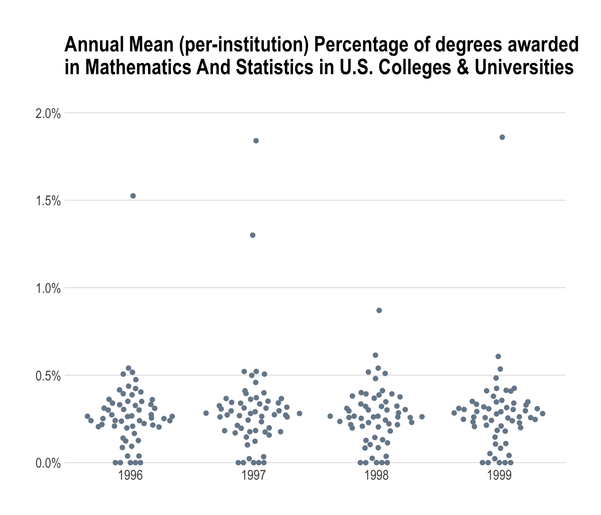

# Reading a "Streaming" JSON (ndjson) Data File With Drill & R 

## Problem

You have [ndjson](http://ndjson.org/)) JSON data files and want to read and query them with Drill and R.

## Solution

Put the files into an organized, accessible directory by Drill and query it with R and `sergeant`.

## Discussion

The previous recipe covered the two basic flavours of JSON, traditional (a complete, syntactically correct object) and streaming/ndjson which is a file of flattened JSON records one per-line. 

One example with a likely familiar data layout is an archive of 170 million tweets collected during the 3 months leading up to the 2012 U.S. presiential election.^[[Twitter 2012 Presidential Election](https://old.datahub.io/dataset/twitter-2012-presidential-election)]. Another example would be Rapid7's "Forward DNS (FDNS)" studies^[[Rapid7 FDNS](https://scans.io/study/sonar.fdns_v2)]. Yet another is the Yelp Challenge dataset^[[Yelp Challenge](https://www.yelp.com/dataset/download)]. Those archives are multiple gigabytes (and, in some cases, substantially more) each and a previous recipe already took up 2+GB of data on your system, so asking folks to download additional files of this size would be more than unkind. Unfortunately, the ndjson format (and, Drill, for that matter) was designed to solve "big data" problems and ndjson is often used in the context of large data sets.

>If you have smaller ndjson data sets that could be used for this example, please file an issue. The goal of the cookbook is to be as "real world" helpful to folks as possible and "real" data beats tutorial-crafted data any day.

We'll _reuse_ some existing data and give a sneak peek at a powerful capability of Drill that we'll see in later recipes. This feature is the ability to write data out to different file types or storage engines. In this case, we'll convert a few of the files from Recipe 5 (reading in a directory of CSV files) into streaming JSON and do some light querying with them.

You'll need to bring up a terminal/command shell for this work since we need to operate in a contained session since we're going to alter the default output format to JSON and convert three CSV files for use in the examples here. Assuming you followed the advice to run Drill as a server/service and also followed the advice in the Drill manual and added the Drill `bin` directory to your system `PATH`, you can start a Drill query session at the command line with:

    $ drill-conf
    apache drill 1.13.0
    "drill baby drill"
    0: jdbc:drill:>

>You can always `cd` to the `drill` directory and `bin/dill-conf` if the directory is not in your `PATH`.

Now, we need to alter the session data storage format to 'json':

    0: jdbc:drill:> ALTER SESSION SET `store.format`='json';
    +-------+------------------------+
    |  ok   |        summary         |
    +-------+------------------------+
    | true  | store.format updated.  |
    +-------+------------------------+
    1 row selected (0.133 seconds)

By default, the `dfs.root` schema is _immutable_ (i.e. "read only"). **This is a very sane setting** and changing it is **not** recommended. For now, we'll store our new ndjson files in the default temporary (which is `/tmp` on Linux systems and `TBD` on Windows) and use the Drill `CREATE TABLE AS` (CTAS)^[[CTAS Manual Page](https://drill.apache.org/docs/create-table-as-ctas/)] command 

    0: jdbc:drill:> CREATE TABLE dfs.tmp.`/1996-97` AS SELECT * FROM dfs.root.`/Users/bob/Data/CollegeScorecard_Raw_Data/MERGED1996_97_PP.csv`;
    +-----------+----------------------------+
    | Fragment  | Number of records written  |
    +-----------+----------------------------+
    | 0_0       | 6794                       |
    +-----------+----------------------------+
    1 row selected (11.9 seconds)

    0: jdbc:drill:> CREATE TABLE dfs.tmp.`/1997-98` AS SELECT * FROM dfs.root.`/Users/bob/Data/CollegeScorecard_Raw_Data/MERGED1997_98_PP.csv`;
    +-----------+----------------------------+
    | Fragment  | Number of records written  |
    +-----------+----------------------------+
    | 0_0       | 6699                       |
    +-----------+----------------------------+
    1 row selected (9.743 seconds)

    0: jdbc:drill:> CREATE TABLE dfs.tmp.`/1998-99` AS SELECT * FROM dfs.root.`/Users/bob/Data/CollegeScorecard_Raw_Data/MERGED1998_99_PP.csv`;
    +-----------+----------------------------+
    | Fragment  | Number of records written  |
    +-----------+----------------------------+
    | 0_0       | 6480                       |
    +-----------+----------------------------+
    1 row selected (9.536 seconds)

    0: jdbc:drill:> CREATE TABLE dfs.tmp.`/1999-00` AS SELECT * FROM dfs.root.`/Users/bob/Data/CollegeScorecard_Raw_Data/MERGED1999_00_PP.csv`;
    +-----------+----------------------------+
    | Fragment  | Number of records written  |
    +-----------+----------------------------+
    | 0_0       | 6466                       |
    +-----------+----------------------------+
    1 row selected (9.459 seconds)

The temporary directory will now have three new subdirectores with a single JSON file in them:

    /tmp/1996-97
    └── [328M]  0_0_0.json
    /tmp/1997-98
    └── [327M]  0_0_0.json
    /tmp/1998-99
    └── [329M]  0_0_0.json
    /tmp/1999-00
    └── [342M]  0_0_0.json

While you haven't downloaded a few hundred MB more data, you have created a three more large files and if you were to compare these each file to its CSV counterpart, you'd see they are much larger (uncompressed). This is due to ndjson repeating `key:value` pairs for each record. Now, we'll compress them:

    $ gzip /tmp/1996-97/0_0_0.json
    $ gzip /tmp/1997-98/0_0_0.json
    $ gzip /tmp/1998-99/0_0_0.json
    $ gzip /tmp/1999-00/0_0_0.json

and see that they compress quite nicely:

    /tmp/1996-97
    └── [ 38M]  0_0_0.json.gz
    /tmp/1997-98
    └── [ 40M]  0_0_0.json.gz
    /tmp/1998-99
    └── [ 40M]  0_0_0.json.gz
    /tmp/1999-00
    └── [ 43M]  0_0_0.json.gz

In fact, each file is now _smaller_ than its CSV counterpart.

We're going to remove these files in the long run, so we'll keep them in this temporary directory but let's move them underneath a common subdirectory since organized data is way better than disorganized data:

    $ mkdir /tmp/college-scorecard
    $ mv /tmp/1996-97/0_0_0.json.gz /tmp/9college-scorecard/196-1997.json.gz
    $ mv /tmp/1997-98/0_0_0.json.gz /tmp/college-scorecard/1997-1998.json.gz
    $ mv /tmp/1998-99/0_0_0.json.gz /tmp/college-scorecard/1998-1999.json.gz
    $ mv /tmp/1999-00/0_0_0.json.gz /tmp/college-scorecard/1999-2000.json.gz

Leaving us with:

    /tmp/college-scorecard/
    ├── [ 38M]  1996-1997.json.gz
    ├── [ 40M]  1997-1998.json.gz
    ├── [ 40M]  1998-1999.json.gz
    └── [ 43M]  1999-2000.json.gz

_Now_ we can work with these in Drill and R. You've already _kinda_ seen the data before so we'll just work with a few fields from it. By referencing the data dictionary^[[College Scorecard Data Dictionary](https://collegescorecard.ed.gov/assets/CollegeScorecardDataDictionary.xlsx)] we can see that:

- `col_UNITID` is the unique "unit id" for the institution
- `INSTNM` is the institution name
- `CITY` & `STABBR` is the city/state location information for the institution, and
- `PCIP27` is _'Percentage of degrees awarded in Mathematics And Statistics.'_

_However_, no field in the data dictionary specifies a year or date/timestamp for the record. That data is encoded in the names of the files in the original CSVs. Thankfully, we carried that over to our ndjson format and can use one of Drill's implicit columns^[[Drill Implicit Columns](https://drill.apache.org/docs/querying-a-file-system-introduction/#implicit-columns)] and can include that in any queries.

Let's see what the average percentage of degrees awarded in math+stats by state for the four years we've converted. While we _could_ just use:

    scorecards <- tbl(db, "dfs.tmp.`/college-scorecard/*.json.gz`") 

we need the `filename` field and that means a using custom query to generate the table. So we'll also thin out the data we're retrieving at the same time:


```r
library(sergeant)
library(tidyverse)

db <- src_drill("localhost")

tbl(db, "(
SELECT
  SUBSTR(filename, 1, 4) AS start_year,
  STABBR AS state,
  PCIP27 AS pct_math_stats
FROM dfs.tmp.`/college-scorecard/*.json.gz`
)") -> scorecards

scorecards
```

```
## # Source:   table<( SELECT SUBSTR(filename, 1, 4) AS start_year, STABBR AS
## #   state, PCIP27 AS pct_math_stats FROM
## #   dfs.tmp.`/college-scorecard/*.json.gz` )> [?? x 3]
## # Database: DrillConnection
##    start_year state pct_math_stats
##         <int> <chr>          <dbl>
##  1       1997 AL           0      
##  2       1997 AL           0.00830
##  3       1997 AL           0.00580
##  4       1997 AL           0      
##  5       1997 AL           0      
##  6       1997 AL           0.0365 
##  7       1997 AL           0.0316 
##  8       1997 AL           0.00300
##  9       1997 AL           0      
## 10       1997 AL           0.0241 
## # ... with more rows
```

Now, we accomplsh our goal of looking at the average percentage across states by year. _However_ since the CSV file used `NULL` vs `null` for missing data, the built-in JSON converter had no way to convert it to a SQL missing value, so we'll need to do some more wrangling before computing the means:


```r
mutate(scorecards, pct_math_stats = ifelse(pct_math_stats == 'NULL', 0, pct_math_stats)) %>% 
  mutate(pct_math_stats = as.numeric(pct_math_stats)) %>% 
  group_by(start_year, state) %>% 
  summarise(mean_pct = mean(pct_math_stats)) %>%
  collect() %>% # NOTE: all the above were in-Drill operations until this collect() line
  ungroup() -> stats_avg 
```

That pretty readable bit of R code generates this SQL query in Drill:

    SELECT `start_year`, `state`, AVG(`pct_math_stats`) AS `mean_pct`
    FROM (SELECT `start_year`, `state`, CAST(`pct_math_stats` AS DOUBLE) AS `pct_math_stats`
    FROM (SELECT `start_year`, `state`, 
          CASE WHEN (`pct_math_stats` = 'NULL') THEN (0.0) 
               WHEN NOT(`pct_math_stats` = 'NULL') THEN (`pct_math_stats`) 
          END AS `pct_math_stats`
    FROM  (
    SELECT
        SUBSTR(filename,  1,  4)  AS  start_year,
        STABBR  AS  state,
        PCIP27  AS  pct_math_stats
    FROM  dfs.tmp.`/college-scorecard/*.json.gz`
    ) ) `raqjqhtatv`) `fjxlsbemuv`
    GROUP BY `start_year`, `state`


```r
library(hrbrthemes)

mutate(stats_avg, start_year = as.Date(sprintf("%s-01-01", start_year))) %>% 
  ggplot(aes(start_year, mean_pct)) +
  ggbeeswarm::geom_quasirandom(color="lightslategray") +
  scale_y_percent(limits=c(0,0.02)) +
  labs(
    x=NULL, y=NULL,
    title="Annual Mean (per-institution) Percentage of degrees awarded\nin Mathematics And Statistics in U.S. Colleges & Universities\n"
  ) +
  theme_ipsum(grid="Y")
```



## See Also

- [JSON Data Model](https://drill.apache.org/docs/json-data-model/)
- [Querying Complex Data](https://drill.apache.org/docs/querying-complex-data-introduction/)
